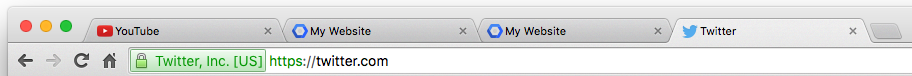
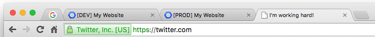
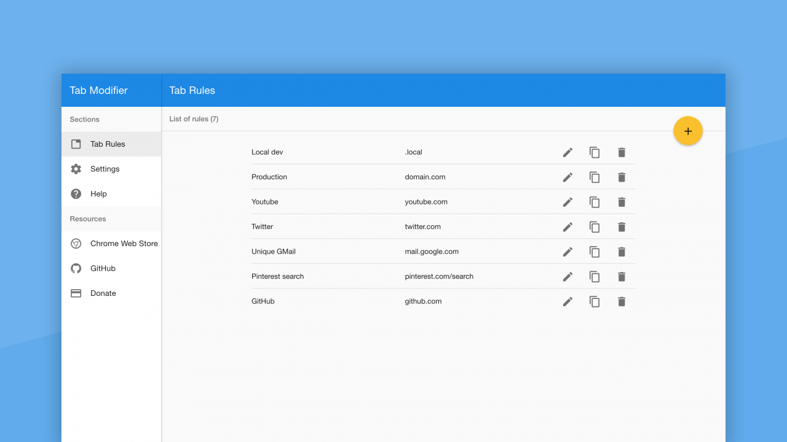
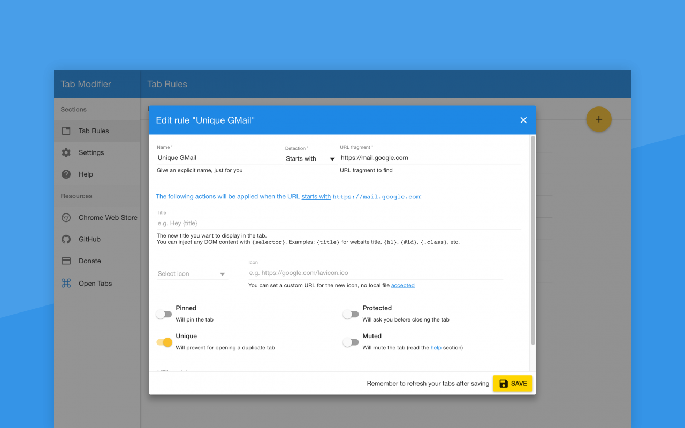
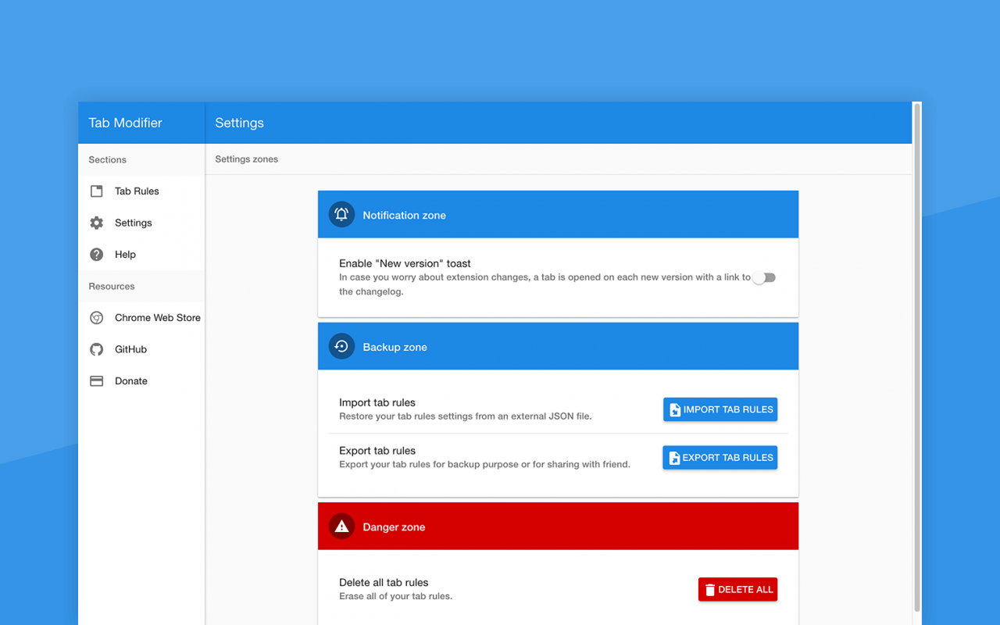
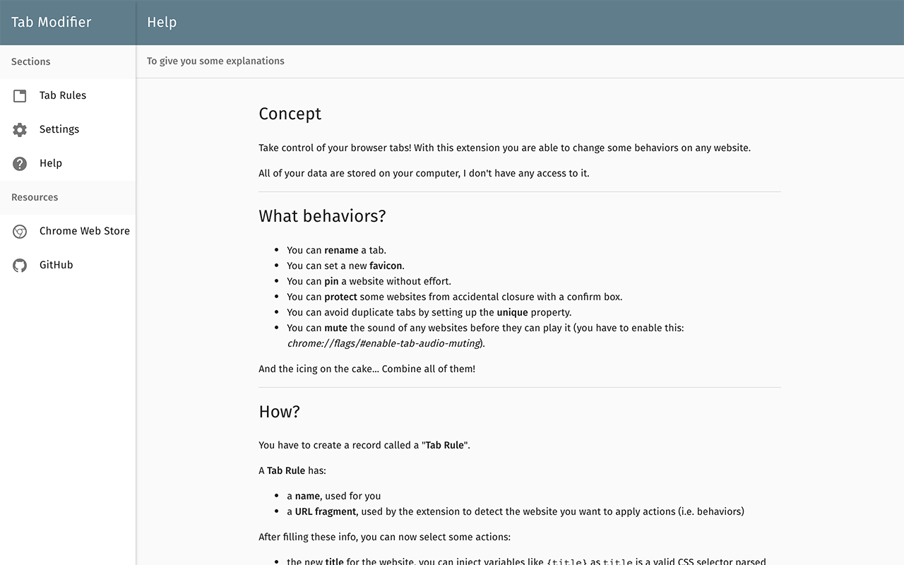

#  Tab Modifier

Take control of your tabs.

[](https://travis-ci.org/sylouuu/chrome-tab-modifier)
[](https://david-dm.org/sylouuu/chrome-tab-modifier#info=devDependencies)

## Features

* Rename tab
* Change tab icon
* Pin tab
* Prevent tab closing
* Unique tab
* Mute tab

## Why?

I needed a quick UI element in Chrome to know the environment of the tab, as a Web developer I often use multiple versions of the same website: local, pre-production and production.

Not easy to find the appropriate tab when you have multiple tabs called "My awesome website".

I created Tab Modifier to add prefixes to website titles with a specific match.

* [DEV] My awesome website: `.local.domain.com`
* [PREPROD] My awesome website: `.preprod.domain.com`
* [PROD] My awesome website: `.domain.com`

After that, I have added more features like "auto-pin", custom favicons and more.

## Focused scope

Tab Modifier is based on user *rules* and act on the tabs that match the first seen rule.

Aware of that, there is no reason to include a feature that is not "rule-based". Prefer to install specific extensions.

## Installation

Install from the **[Chrome Web Store](https://chrome.google.com/webstore/detail/hcbgadmbdkiilgpifjgcakjehmafcjai/)**.

Also available for **[Opera Browser](https://addons.opera.com/fr/extensions/details/tab-modifier/)**.

## Usage

* Click on the  icon to open Options.
* Create your tab rules.
* Try & enjoy!

## Demo

### Before



### After



* Youtube tab has been modified: use Google icon and pinned state.
* My Website tabs have been modified: use a prefix in title.
* Twitter tab has been modified: use default Chrome icon (white paper) and renamed to "I'm working hard!".

## Options

### Tab Rules



### Tab Rules Form



### Settings



### Help



## Examples

You have infinite possibilities, here are some configurations:

Pin all tabs:

* **Detection**: Contains
* **URL fragment**: http
* **Pinned**: ON

Say hello to all Google websites:

* **Detection**: Contains
* **URL fragment**: google.com
* **Title**: Hello Google: {title}

Disguise GitHub as Google

* **Detection**: Contains
* **URL fragment**: github.com
* **Title**: Google
* **Icon**: https://www.google.com/favicon.ico

Prevent accidental tab closure:

* **Detection**: Contains
* **URL fragment**: important-website.com
* **Protected**: ON

Mute all Youtube videos by default:

* **Detection**: Contains
* **URL fragment**: youtube.com
* **Mute**: ON

Set blank icon on Pinterest:

* **Detection**: Contains
* **URL fragment**: pinterest.com
* **Icon**: select "Chrome > Default"

Get only one GMail tab opened at once:

* **Detection**: Starts with
* **URL fragment**: https://mail.google.com
* **Unique**: ON

Pin all PNG images (useless):

* **Detection**: Ends with
* **URL fragment**: .png
* **Pinned**: ON

Customize title with HTML selector and Regexp:

* **Detection**: Contains
* **URL fragment**: github.com
* **Title**: {title} | $2 by $1
* **URL matcher**: github[.]com/([A-Za-z0-9_-]+)/([A-Za-z0-9_-]+)

Tab title will be: "sylouuu/chrome-tab-modifier: Take control of your tabs | chrome-tab-modifier by sylouuu"

Match GitHub repositories:

* **Detection**: RegExp
* **URL fragment**: github[.]com/([A-Za-z0-9_-]+)/([A-Za-z0-9_-]+)
* **Title**: I got you GitHub!

And now, build your own... :muscle:

## Ideas

* Require password after inactivity.

## Known issues

### Local icon path doesn't work

Related issue: [#5](https://github.com/sylouuu/chrome-tab-modifier/issues/5), [#13](https://github.com/sylouuu/chrome-tab-modifier/issues/13)

Due to browser security restrictions, this path won't work: `file://<path>/icon.png`.
Your icon will not be shown by Chrome.

Alternatively, you can upload your icon somewhere like [imgur.com](http://imgur.com/) and paste the direct link in your rule.

Another solution consists in transform your image in the [Data URI format](https://en.wikipedia.org/wiki/Data_URI_scheme). Go to http://duri.me and drag & drop your icon, then click on "Copy as DataURI" and paste it (the long text) in the icon input on your rule.

### Chrome system pages `chrome://`

Related issues: [#11](https://github.com/sylouuu/chrome-tab-modifier/issues/11), [#14](https://github.com/sylouuu/chrome-tab-modifier/issues/14)

Pages that start with `chrome://` URL are protected. No content script can be injected then Tab Modifier will not work on these pages.

## Changelog

See [releases](https://github.com/sylouuu/chrome-tab-modifier/releases) section.

## Development

In case you want to contribute or just want to play with the code, follow the guide.

### Setup

Download and install [NodeJS](http://nodejs.org/download/) to get [npm](https://www.npmjs.org/).

Install `gulp` globally:

```bash
sudo npm install -g gulp
```

Clone the project and install dependencies with `npm install`.

Type `gulp` to watch your changes inside `src/` folder or type `gulp build` after each change.

### Load local extension in Chrome

Go to `chrome://extensions/` and enable the "Developer mode".

Click on "Load unpacked extension..." and select the project `dist/` folder.

## License

See [license](LICENSE.md) file.
