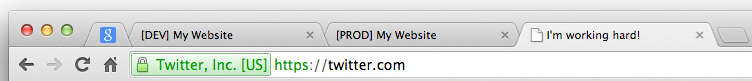
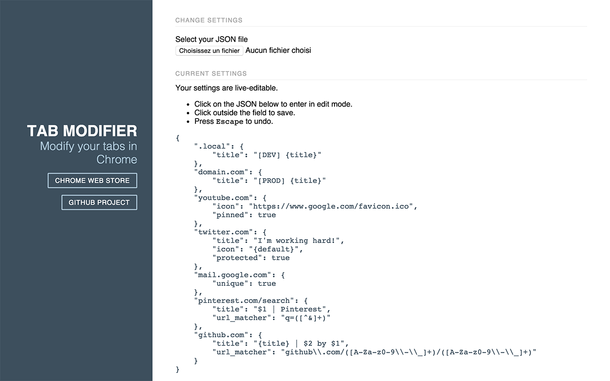

# Tab Modifier

[](https://travis-ci.org/sylouuu/chrome-tab-modifier)
[](https://david-dm.org/sylouuu/chrome-tab-modifier#info=devDependencies)

This Chrome extension allows you to **automatically** change some properties of your tabs, here is the features list:

* Rename the tab
* Change the tab icon
* Pin the tab
* Prevent tab closing
* Unique tab

## How to use?

1. Download and install from the **[Chrome Web Store](https://chrome.google.com/webstore/detail/hcbgadmbdkiilgpifjgcakjehmafcjai/)**.
2. Click on "Tab Modifier" icon in your toolbar to access Options.
3. Copy the sample JSON below and paste it in Options.
4. Try & enjoy!

_Tip: Keep a file like `tab_modifier.json` which contains your custom settings and consider it as a backup. Your settings are saved in your `localStorage`._

## Demo

### Result



### Settings file (sample)

```json
{
    ".local": {
        "title": "[DEV] {title}"
    },
    "domain.com": {
        "title": "[PROD] {title}"
    },
    "youtube.com": {
        "icon": "https://www.google.com/favicon.ico",
        "pinned": true
    },
    "twitter.com": {
        "title": "I'm working hard!",
        "icon": "{default}",
        "protected": true
    },
    "mail.google.com": {
        "unique": true
    },
    "pinterest.com/search" : {
      "title" : "$1 | Pinterest",
      "url_matcher" : "q=([^&]+)"
    },
    "github.com": {
        "title": "{title} | $2 by $1",
        "url_matcher": "github\\.com\/([A-Za-z0-9\\-\\_]+)\/([A-Za-z0-9\\-\\_]+)"
    }
}
```

## File format

```json
{
    "string to match the URL": {
        "title": "...",
        "icon": "http://...",
        "pinned": true,
        "protected": true,
        "unique": true,
        "url_matcher": "<regexp>"
    }
}
```

| Property      | Description                                               |
| :------------ | :-------------------------------------------------------- |
| `title`       | The new title you want to display. You can use use `{title}` inside to append the current website title. |
| `icon`        | URL for the new favicon. For removing the default favicon website, use `{default}` to append the Default Chrome favicon (white paper). |
| `pinned`      | `true` to pin the tab, otherwise nothing happens. |
| `protected`   | `true` will ask you before closing the tab. |
| `unique`      | `true` will prevent for opening a new tab if it is already opened. |
| `url_matcher` | Regular expression to search string fragment(s) and use it inside the `title` property. |

## Examples

Pin all tabs:

```json
{
    "http": {
        "pinned": true
    }
}
```

Say hello to all Google websites:

```json
{
    "google.com": {
        "title": "Hello Google: {title}"
    }
}
```

Prevent accidental tab closure:

```json
{
    "important-website.com": {
        "protected": true
    }
}
```

Get only one GMail tab opened at once:

```json
{
    "mail.google.com": {
        "unique": true
    }
}
```

## Options page



## Known issues

* The extension can't access to Chrome pages `chrome://` ([#11](https://github.com/sylouuu/chrome-tab-modifier/issues/11)).

## Changelog

See [releases](https://github.com/sylouuu/chrome-tab-modifier/releases) section.

## Development

In case you want to contribute or just want to play with the code, follow the guide.

### Setup

Download and install [NodeJS](http://nodejs.org/download/) to get [npm](https://www.npmjs.org/).

Install `gulp` globally:

```bash
sudo npm install -g gulp
```

Clone the project and install dependencies with `npm install`.

Type `gulp` to watch your changes inside `src/` folder or type `gulp build` after each change.

### Load your local extension in Chrome

Go to `chrome://extensions/` and enable the "Developer mode".

Click on "Load unpacked extension..." and select the project `dist/` folder.

## License

See [license](LICENSE.md) file.

