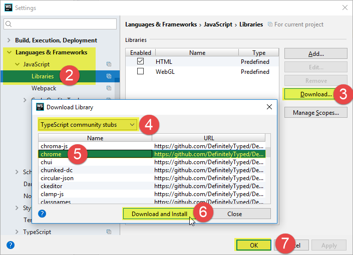

# Tab Modifier

## Description

## First Time Setup

### Install Node Modules

```bash
npm install
```

### Run the development server

```bash
npm run dev
```

### IDE Setup

#### WebStorm

Add chrome types to the project:

* Open the Settings dialog (File > Settings)
* Click Languages & Frameworks > Javascript > Libraries
* Click Download
* Make sure TypeScript community stubs is selected
* Select chrome from the list (you can find it quickly by just typing chrome)
* Click Download and Install
* Click OK to close the Settings dialog.


